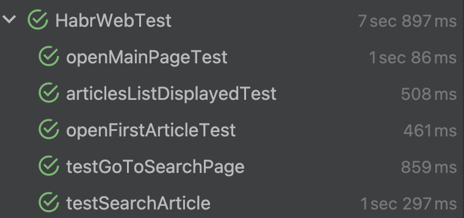
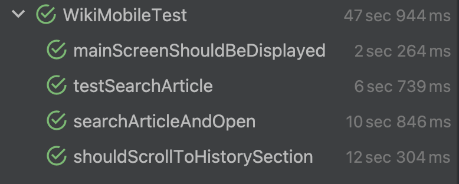

# Итоговый проект | Тестирование сервисов и приложений

Этот проект создан для итогового проекта курса "Тестирование сервисов и приложений".  
Результат проделанной работы: 

1. Создан автоматизированный проект с тестами для веб- и мобильного приложения. 
2. Разработаны тестовые сценарии, проверяющие корректность работы пользовательских интерфейсов сайта и Android-приложения. 
3. В процессе использовались технологии Java, Selenium и TestNG для веб-тестирования, а также Appium для мобильного тестирования. 
4. Проект готов к использованию и может быть включён в портфолио.

# 1. Автотесты для веб-приложения

Были написаны тесты для сайта https://habr.com/

Обработаны следующие сценарии:

1. Открытие главной страницы
2. Проверка отображения списка статей
3. Открытие первой статьи с главной страницы
4. Переход на страницу поиска 
5. Поиск статьи по запросу

Эти сценарии отрабатываются успешно и выводят корректные результаты.

### Как запустить 

Сперва необходимо в [pom.xml](pom.xml) проверить профиль TestNG. Должен быть указан путь до [testng-web.xml](src/test/resources/testng-web.xml).

После этого выполняется команда 
```bash
mvn clean install
```
Запуск тестов осуществляется этой же командой. Возможен запуск с помощью IDE в файле [HabrWebTest.java](src/test/java/org/web/tests/HabrWebTest.java).

**Примечание**: иногда необходимо очистить кэш, чтобы тесты прошли успешно. Для этого в консоли необходимо прописать:
```bash
rm -rf ~/.cache/selenium         
rm -rf ~/.m2/repository/webdriver
```

### Что нужно для запуска веб-тестов

- Java 17 или новее
- Maven
- Браузер Chrome

# 2. Автотесты для мобильного приложения

Были написаны тесты для приложения Wikipedia.

Обработаны следующие сценарии:

1. Открытие главной страницы
2. Поиск по запросу и отображение списка результатов
3. Проверка корректности отображения найденной статьи
4. Проверка прокрутки до секции статьи 

Эти сценарии отрабатываются успешно и выводят корректные результаты.

### Как запустить 

Порядок действий для настройки проекта и его запуска:

1. Node.js  
Скачать и установить Node.js по официальной ссылке - https://nodejs.org/en/download

2. Установка Appium

Через npm:
```bash
npm install -g appium
appium driver install uiautomator2
```

3. Android Studio
Скачать и установить Android Stdio по официальной ссылке - https://developer.android.com/studio/run/emulator?hl=ru

4. Настройка переменных окружения Android

Appium требует переменные `ANDROID_HOME`  
Настройка производится с помощью гайда https://developer.android.com/tools/variables

Признак правильной настройки - в консоли: `adb devices`

5. Запуск эмулятора и проверка подключения

Проверьте подключение после запуска эмулятора в Android Studio:
   ```bash
   adb devices
   ```


6. Установка Wikipedia на эмулятор

Для работы с приложением необходимо установить Wikipedia на эмулятор. Мной это делалось через Google Play. Но возможно установить apk напрямую:
```bash
adb install путь_к_файлу/wikipedia.apk
```

6. Настройка проекта

В файле [AppiumCustomDriver.java](src/test/java/org/mobile/utils/AppiumCustomDriver.java) настраивается драйвер для работы с эмулятором.  
Необходимо указать настройки эмулятора

7. Запуск Appium Server
Сервер запускается командой и необходим для работы с приложением:
```bash
appium
```
 
9. Подготовка приложения:  
Необходимо в [pom.xml](pom.xml) проверить профиль TestNG. Должен быть указан путь до [testng-mobile.xml](src/test/resources/testng-mobile.xml)
После этого выполняется команда
```bash
mvn clean install
```

Запуск тестов осуществляется этой же командой. Возможен запуск с помощью IDE в файле [WikiMobileTest.java](src/test/java/org/mobile/tests/WikiMobileTest.java)

## Что нужно для запуска мобильных-тестов

- Java 17 или новее
- Maven
- Appium
- Android эмулятор или телефон
- Приложение Wikipedia должно быть установлено
- Android SDK 

Результаты выполнения тестов:

* Веб-тесты: 100% успешных тестов  

* Мобильные-тесты: 100% успешных тестов  
